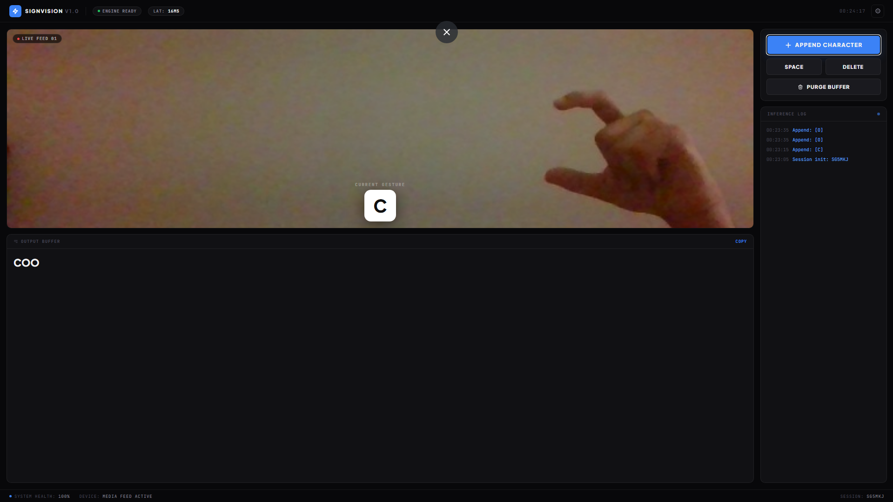
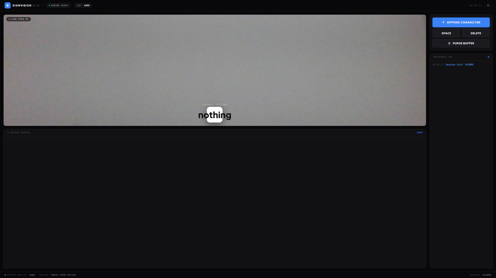
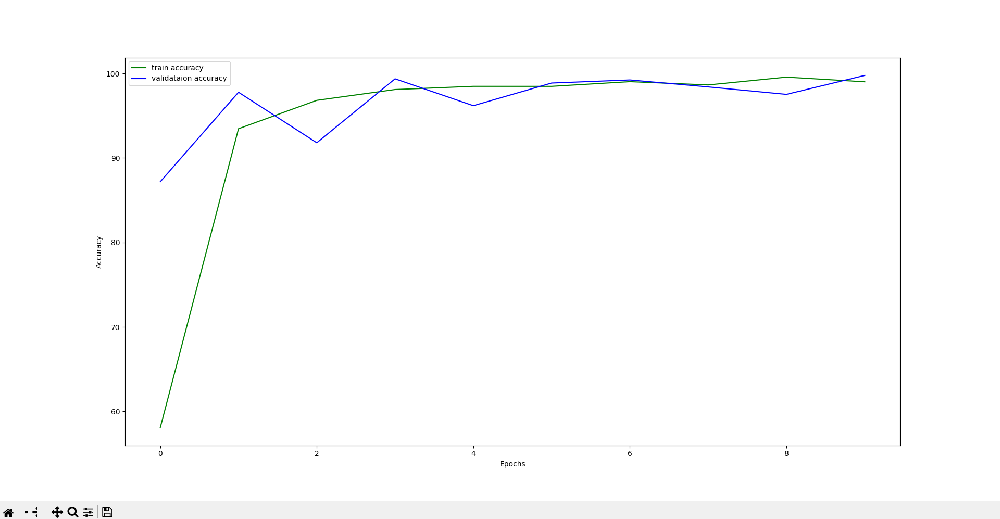
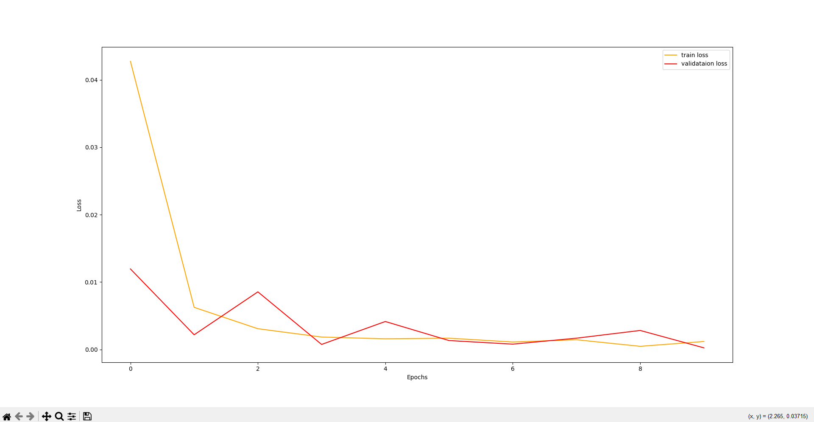

# American Sign Language Detection using Deep Learning

Real-time American Sign Language (ASL) alphabet recognition from a webcam feed, powered by a custom CNN built in PyTorch. Includes a browser-based web app ("SignVision") for live detection, on top of the original training and testing pipeline.

<p align="center">
  
</p>

## About the Project

This project detects ASL alphabet signs (A–Z, plus `space`, `del`, and `nothing`) from webcam video in real time and outputs the recognized letters as text. It started as a CNN training pipeline and has since grown into a full web application with a live video feed, an on-screen prediction, and a text buffer that can be built up letter by letter and copied out.

<p align="center">
  
</p>

## Features

- Real-time webcam-based ASL alphabet detection
- Custom CNN trained from scratch - no pretrained backbone, no external hand-landmark model
- Browser-based UI (Flask + vanilla JS) with a live MJPEG video stream, prediction overlay, and inference log
- Output buffer with append, space, delete, and purge controls, plus one-click copy to clipboard
- Standalone desktop packaging via PyInstaller
- Static image testing script for evaluating on individual images

## Results

Trained for 10 epochs on an 85/15 stratified train-validation split. Train and validation accuracy converge closely to roughly 99% with no significant overfitting gap.

<p align="center">
  
  
</p>

## Model Architecture

A custom CNN (`CustomCNN` in `src/cnn_models.py`), built from scratch:

```
Input: (B, 3, 224, 224)
  Conv2d(3   → 16,  kernel=5) → ReLU → MaxPool2d(2)
  Conv2d(16  → 32,  kernel=5) → ReLU → MaxPool2d(2)
  Conv2d(32  → 64,  kernel=3) → ReLU → MaxPool2d(2)
  Conv2d(64  → 128, kernel=5) → ReLU → MaxPool2d(2)
  AdaptiveAvgPool2d(1) → Flatten → (B, 128)
  Linear(128 → 256) → ReLU
  Linear(256 → 29)   ← output logits
```

**Training configuration:**

| Parameter        | Value                          |
|-------------------|---------------------------------|
| Epochs            | 10 (configurable)               |
| Batch size         | 32                               |
| Optimizer          | Adam, lr = 0.001                 |
| Loss function       | Cross-Entropy Loss              |
| Train/val split      | 85% / 15%, stratified, seed 42 |
| Device            | CUDA if available, else CPU     |

At inference time the model is loaded with `map_location='cpu'`, so the app runs without requiring a GPU.

## Dataset

[ASL Alphabet dataset on Kaggle](https://www.kaggle.com/grassknoted/asl-alphabet) - 87,000 images across 29 classes (A–Z, `del`, `nothing`, `space`). A configurable subset of images per class is sampled and resized to 224×224 during preprocessing.

## Tech Stack

| Layer | Technology |
|---|---|
| Language | Python 3.10 |
| Deep learning | PyTorch >= 1.4 |
| Computer vision | OpenCV |
| Augmentation | Albumentations >= 0.4.3 |
| ML utilities | Scikit-Learn >= 0.22.1 |
| Data handling | Pandas, NumPy |
| Model serialization | joblib (label binarizer), `torch.save` (weights) |
| Web framework | Flask + Jinja2 |
| Frontend | Vanilla HTML/CSS/JS |
| Packaging | PyInstaller |

## Directory Structure

```
├───input
│   ├───asl_alphabet_test
│   │   └───asl_alphabet_test
│   ├───asl_alphabet_train
│   │   └───asl_alphabet_train
│   │       ├───A
│   │       ├───B
│   │       ...
│   └───preprocessed_image
│       ├───A
│       ├───B
│       ...
├───outputs
│   │   model.pth
│   │   lb.pkl
│   │   accuracy.png
│   │   loss.png
│   │   asl.mp4
│   │   A_test.jpg ... Z_test.jpg
├───templates
│   │   index.html
├───src
│   │   app.py
│   │   cam_test.py
│   │   cnn_models.py
│   │   create_csv.py
│   │   preprocess_image.py
│   │   test.py
│   │   train.py
└───app.spec
```

- `input/` - original Kaggle data plus the preprocessed, resized images used for training.
- `outputs/` - trained model weights, label binarizer, accuracy/loss plots, test predictions, and recorded webcam sessions.
- `templates/` - frontend for the Flask web app.
- `src/` - all the Python source files (see below).
- `app.spec` - PyInstaller spec for building a standalone executable.

### Source Files

| File | Purpose |
|---|---|
| `preprocess_image.py` | Samples and resizes N images per class for training |
| `create_csv.py` | Maps preprocessed image paths to labels in a CSV |
| `cnn_models.py` | Custom CNN architecture definition |
| `train.py` | Trains the model on the preprocessed dataset |
| `test.py` | Runs inference on static test images |
| `cam_test.py` | Real-time detection via a plain OpenCV window |
| `app.py` | Flask web app - live webcam detection with a full UI |

## Installation

```bash
git clone https://github.com/sovit-123/American-Sign-Language-Detection-using-Deep-Learning.git
cd American-Sign-Language-Detection-using-Deep-Learning
pip install -r requirements.txt
```

Download the [ASL Alphabet dataset](https://www.kaggle.com/grassknoted/asl-alphabet) and place it inside an `input/` folder at the project root.

## Usage

Run all commands from inside the `src` folder, in order:

```bash
# 1. Preprocess a subset of the dataset (per-class image count is configurable)
python preprocess_image.py --num-images 1200

# 2. Generate the CSV mapping image paths to labels
python create_csv.py

# 3. Train the model
python train.py --epochs 10

# 4. Test on a single image
python test.py --img A_test.jpg

# 5. Run real-time detection in a plain OpenCV window
python cam_test.py
```

### Running the Web App

```bash
python app.py
```

Then open `http://127.0.0.1:5000` in your browser. This launches the full SignVision UI: a live video feed, current gesture prediction, output text buffer with append/space/delete/purge controls, and a running inference log.

### Building a Standalone App

The project includes a PyInstaller spec (`app.spec`) to package the web app into a standalone executable:

```bash
pyinstaller app.spec
```

## Roadmap

- Replace the fixed ROI box with proper hand-landmark tracking for more flexible framing
- Expand beyond static alphabet signs to word- and phrase-level recognition
- Improve robustness to lighting and background variation

## References

- [ASL Alphabet dataset - Kaggle](https://www.kaggle.com/grassknoted/asl-alphabet)
- [Changing the contrast and brightness of an image - OpenCV docs](https://docs.opencv.org/3.4/d3/dc1/tutorial_basic_linear_transform.html)
- [Real-time American Sign Language Recognition with Convolutional Neural Networks](http://cs231n.stanford.edu/reports/2016/pdfs/214_Report.pdf) - Brandon Garcia et al.
